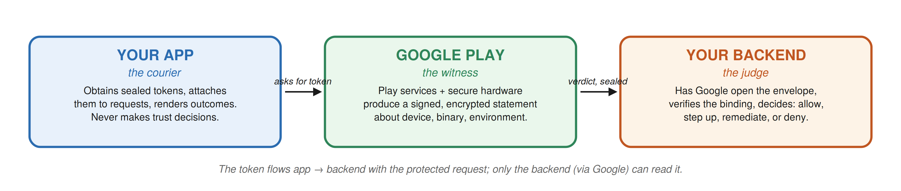
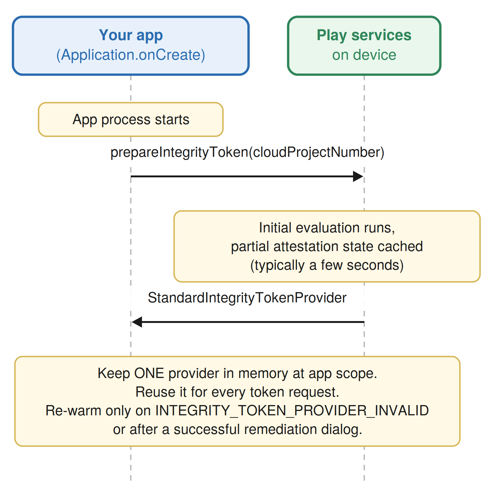
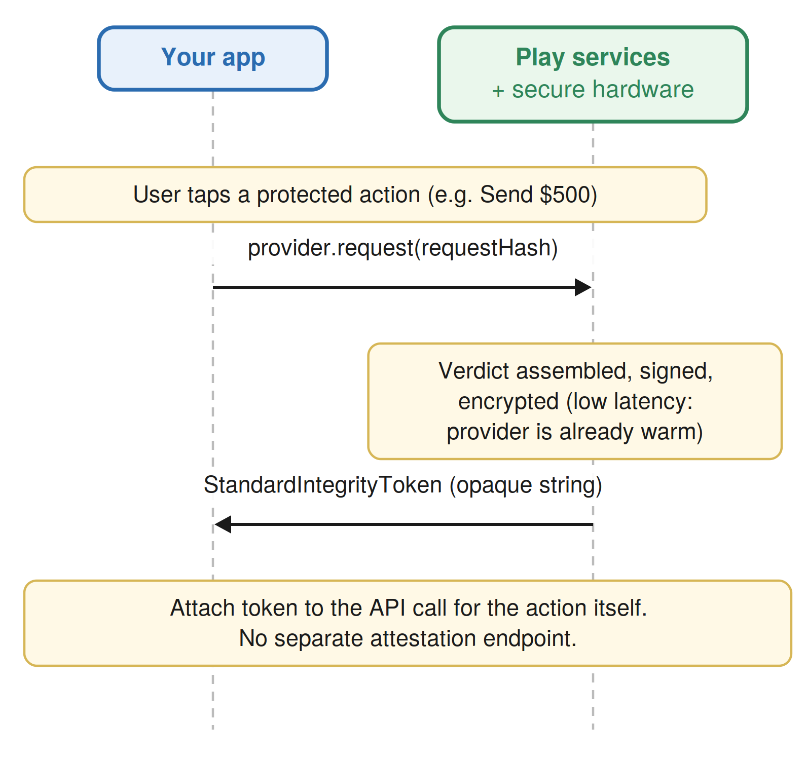
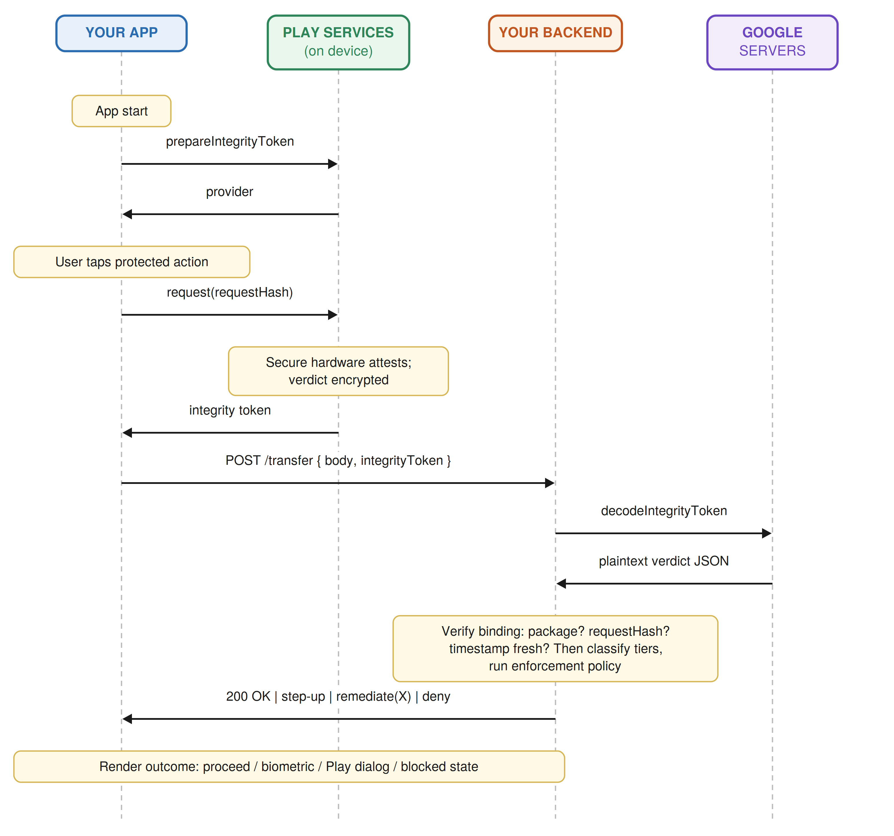
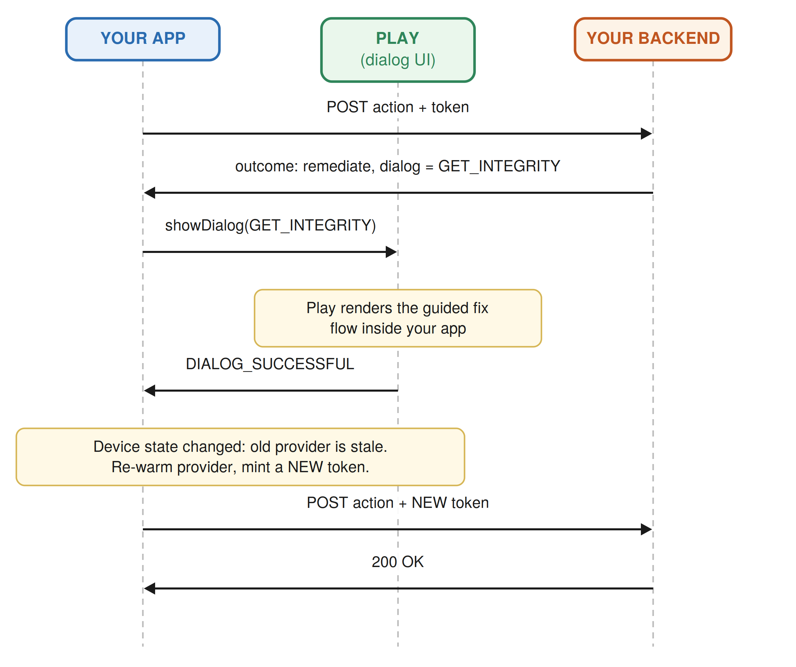
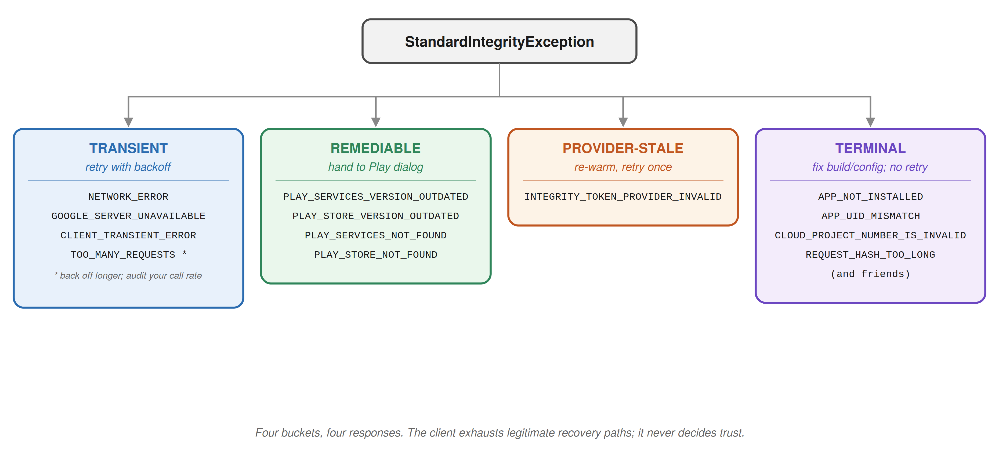
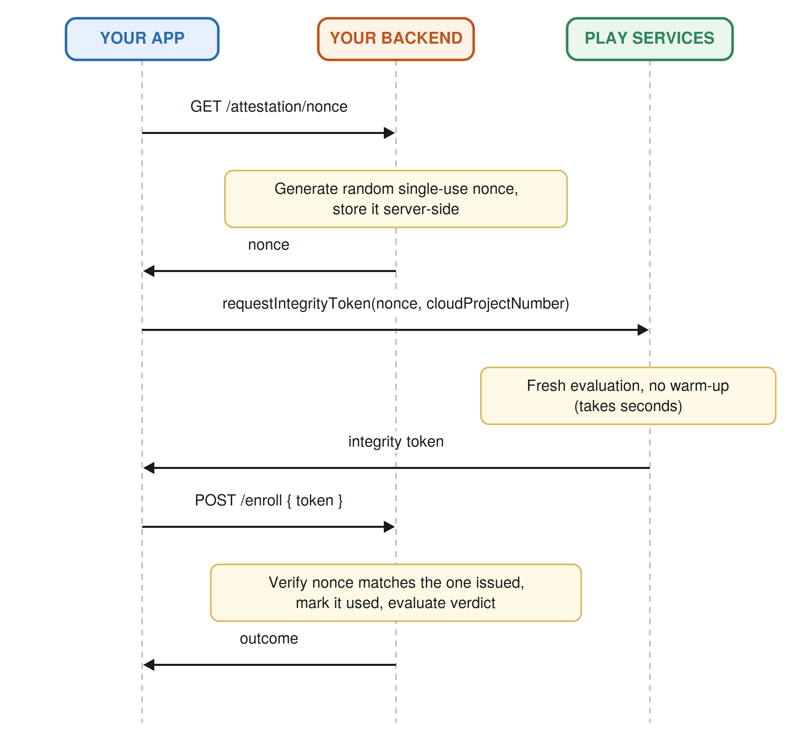

# Building the Play Integrity Client, Step by Step
### A beginner-friendly but complete implementation guide (library 1.5.0+, 2026 edition)

This guide walks through building a production-grade Play Integrity client from an empty project to a full implementation using every feature the modern library offers: Standard requests, request hashing, verdict opt-outs, remediation dialogs, the full error taxonomy, and Classic requests for the one place they still belong. Every step explains *why* before *how*.

---

## Step 0: The mental model (read this first)

Three parties are involved in every attestation, and keeping their roles straight makes everything else obvious:



- **Your app is a courier.** It asks Google for a sealed envelope (the integrity token), attaches it to a request, and delivers it. It cannot open the envelope, and it must never make trust decisions, because the attacker owns the device your app runs on.
- **Google Play is the witness.** Play services on the device, backed by the secure hardware, produces a signed, encrypted statement about the device, the app binary, and the environment.
- **Your backend is the judge.** It has Google open the envelope, checks the statement belongs to this exact request, and decides: allow, step up, remediate, or deny.

Everything you build client-side serves the courier role: obtain tokens efficiently, bind them to actions correctly, handle failure gracefully, and render whatever verdict the judge hands back.

---

## Step 1: Project and Play Console setup

**Gradle:**

```kotlin
// app/build.gradle.kts
dependencies {
    implementation("com.google.android.play:integrity:1.5.0")
}

android {
    defaultConfig {
        minSdk = 23   // 1.5.0 raised the floor to API 23 for both request modes
    }
}
```

**Play Console (one-time, and someone with console access must do it):**

1. Play Console → your app → *Test and release* → *App integrity* (a.k.a. Protected with Play) → *Play Integrity API* → link a Google Cloud project. Note the **cloud project number** (a long integer, not the project ID string). The client needs it for warm-up.
2. Under *Responses*, opt in to the optional verdict fields you want: deviceAttributes, recentDeviceActivity, environmentDetails (app access risk, Play Protect), and deviceRecall if approved for the beta. Fields you don't enable simply never appear in the payload.
3. Set up an **internal testing track** and upload your build there. Here's the problem this solves. Part of every verdict is Play answering the question "is this binary one that I, Google Play, delivered to this device?" Play can only answer yes for builds it has actually seen and distributed. During normal development you don't install your app through Play; you hit Run in Android Studio, which compiles a debug build, signs it with your machine's local debug key, and pushes it onto the device over adb. From Play's point of view that app materialized out of nowhere: unknown version, unknown signing certificate, never downloaded through the store. So the verdict for your own dev build comes back with appIntegrity = UNRECOGNIZED_VERSION (Play doesn't recognize this binary) and accountDetails = UNLICENSED (this account never got the app through Play). Your app looks exactly like a tampered sideload, because mechanically it is one. The fix is Play Console's internal testing track: a private distribution channel where you upload builds that only an allowlist of tester accounts (your team) can see and install, with near-instant publishing and no review delay. When a teammate installs the build from that track, Play delivered it, Play knows its signature and version, and the verdicts come back clean. So the practical dev workflow becomes two-lane: adb builds for day-to-day feature work where attestation doesn't matter, and internal-track installs whenever you're actually testing the integrity flow end to end.

---

## Step 2: Warm up the provider at app startup

**The why:** Standard requests are fast because most of the expensive work (talking to Play services, initial device evaluation) happens ahead of time in a *warm-up* step called `prepareIntegrityToken`. The warm-up hands you a `StandardIntegrityTokenProvider`, a reusable factory that can then mint tokens on demand with very low latency. Warming up is slow-ish and rate-limited (about 5 calls per app instance per minute), so you do it rarely: at app start, and again only if the provider goes stale.



```kotlin
class AttestationWarmup(
    private val appContext: Context,
    private val cloudProjectNumber: Long   // from Play Console, e.g. 123456789012
) {
    private val manager: StandardIntegrityManager =
        IntegrityManagerFactory.createStandard(appContext)

    // Volatile because UI thread reads it, callback thread writes it
    @Volatile var provider: StandardIntegrityTokenProvider? = null
        private set

    fun warmUp(onReady: () -> Unit = {}, onFailure: (Exception) -> Unit = {}) {
        manager.prepareIntegrityToken(
            PrepareIntegrityTokenRequest.builder()
                .setCloudProjectNumber(cloudProjectNumber)
                .build()
        )
            .addOnSuccessListener { p -> provider = p; onReady() }
            .addOnFailureListener { e -> onFailure(e) }
    }
}
```

**Placement guidance:**

- Kick off `warmUp()` from `Application.onCreate()` (or your DI graph's app-scope init) so the provider is ready before the user reaches any protected action. It's asynchronous and does not block startup.
- Do **not** warm up per-Activity or per-request. One provider per process, reused.
- The provider can become invalid over time (you'll see `INTEGRITY_TOKEN_PROVIDER_INVALID` when requesting). How long is "over time"? Google deliberately doesn't document a TTL; the official contract is reactive: reuse the provider until a request fails with that error, then call `prepareIntegrityToken` again. So the re-warm-on-error path is mandatory, not an optimization. On top of it, a reasonable proactive heuristic for long-lived processes is to refresh roughly once per 24 hours of process lifetime or when the app returns to foreground after a long background stretch. For most apps, whose process dies and restarts daily anyway, the warm-up in `Application.onCreate()` effectively is that refresh, and the -19 error will be rare.

---

## Step 3: Build the request hash (the most important 10 lines you'll write)

**The why:** a token that isn't bound to a specific action is a bearer instrument: steal it once, spend it anywhere. The `requestHash` welds the token to the exact action being attempted. You compute a digest of the action's meaningful fields on the client; your backend recomputes the same digest from the request it actually received; if they differ, someone moved the token to a different request.

Rules: max 500 characters, and it must be derived from the *semantics* of the action (what is being done, to whom, for how much, with which idempotency key), not from random data the server can't recompute.

```kotlin
object RequestHasher {
    fun forAction(action: ProtectedAction): String {
        val canonical = buildString {
            append(action.type)                    // "TRANSFER"
            append('|'); append(action.amountMinorUnits)
            append('|'); append(action.destinationId)
            append('|'); append(action.idempotencyKey)
        }
        val digest = MessageDigest.getInstance("SHA-256")
            .digest(canonical.toByteArray(Charsets.UTF_8))
        return Base64.encodeToString(
            digest,
            Base64.URL_SAFE or Base64.NO_WRAP or Base64.NO_PADDING
        )
    }
}
```

Beginner pitfall to call out: the canonical string construction must be *identical* on client and server, down to field order and separators. Treat it like a wire format: document it, version it, and never build it by string-concatenating whatever fields feel handy that day.

---

## Step 4: Request the token for a protected action

**The why:** with a warm provider and a request hash, minting a token is one call. This is the moment the sealed envelope gets created.



```kotlin
class TokenFetcher(private val warmup: AttestationWarmup) {

    fun fetch(
        action: ProtectedAction,
        onToken: (String) -> Unit,
        onError: (Exception) -> Unit
    ) {
        val provider = warmup.provider
        if (provider == null) {
            // Provider not ready: warm up, then retry once
            warmup.warmUp(onReady = { fetch(action, onToken, onError) }, onFailure = onError)
            return
        }

        val request = StandardIntegrityTokenRequest.builder()
            .setRequestHash(RequestHasher.forAction(action))
            .build()

        provider.request(request)
            .addOnSuccessListener { response -> onToken(response.token()) }
            .addOnFailureListener { e -> onError(e) }
    }
}
```

**Opting out of signals per request:** some verdict fields cost latency or are irrelevant for low-risk calls. For example, if app access risk analysis is enabled account-wide but this particular request is a harmless read, you can skip it for this request:

```kotlin
val request = StandardIntegrityTokenRequest.builder()
    .setRequestHash(RequestHasher.forAction(action))
    .setVerdictOptOut(setOf(StandardIntegrityTokenRequest.VerdictOptOut.APP_ACCESS_RISK))
    .build()
```

(Verify the exact opt-out enum surface against the 1.5.x javadoc when you integrate; the console opt-in plus per-request opt-out shape is the stable concept.)

**How often should you attest?** Not on every network call. The clean pattern: attest at session establishment plus at each *protected action* (payment, credential change, high-value read). Standard requests are cheap but not free, and recentDeviceActivity means your own over-attesting inflates your users' activity levels.

---

## Step 5: The full round trip (what the wire actually looks like)

This is the complete Standard-request sequence with every party on stage. Read it top to bottom once slowly; the rest of the guide is just implementing boxes from this diagram.



The key beginner insight hiding in this diagram: **the token travels with the action it protects, in the same request.** There is no separate "attestation endpoint" the app calls first. Attestation is a property attached to a protected call, not a login-style ceremony done once.

---

## Step 6: Handle the server's decision, including remediation dialogs

**The why:** your backend replies with one of a small vocabulary of outcomes. Three are trivial to render (proceed, step-up, deny). The interesting one is *remediate*: since library 1.5.0, when the verdict problem is fixable by the user (sideloaded install, outdated Play services, weak device integrity, risky screen-sharing app running), your app can ask Play itself to walk the user through the fix in a bottom-sheet overlay. You write none of that UX.

The dialog catalog:

| Dialog type | What it fixes / drives toward |
|---|---|
| `GET_INTEGRITY` | The generalist: unlicensed install, unrecognized version, weak device verdict, remediable client errors |
| `GET_STRONG_INTEGRITY` | Everything above, plus drives toward MEETS_STRONG_INTEGRITY and clean Play Protect |
| `GET_LICENSED` | Focused licensing recovery (install/acquire via Play) |
| `CLOSE_UNKNOWN_ACCESS_RISK` | Prompts user to close unknown capturing/controlling apps |
| `CLOSE_ALL_ACCESS_RISK` | Same, but all capturing/controlling apps |

The loop, drawn out:



```kotlin
fun handleServerOutcome(
    outcome: ServerOutcome,
    activity: Activity,
    manager: StandardIntegrityManager,
    originalResponse: StandardIntegrityToken,   // keep it: the dialog call needs it
    retryFlow: () -> Unit
) {
    when (outcome) {
        ServerOutcome.Proceed -> proceed()
        is ServerOutcome.StepUp -> launchStepUp(outcome.method)   // biometric, OTP, etc.
        is ServerOutcome.Deny -> showBlockedState(outcome.message)

        is ServerOutcome.Remediate -> {
            val dialogRequest = StandardIntegrityDialogRequest.builder()
                .setActivity(activity)
                .setType(outcome.dialogTypeCode)          // e.g. IntegrityDialogTypeCode.GET_INTEGRITY
                .setStandardIntegrityResponse(originalResponse)
                .build()

            manager.showDialog(dialogRequest)
                .addOnSuccessListener { code ->
                    when (code) {
                        IntegrityDialogResponseCode.DIALOG_SUCCESSFUL -> {
                            // The device state just changed; the provider's cached
                            // evaluation is stale. Re-warm, re-attest, retry the action.
                            retryFlow()
                        }
                        IntegrityDialogResponseCode.DIALOG_CANCELLED ->
                            showBlockedState("Action unavailable until the issue is resolved.")
                        IntegrityDialogResponseCode.DIALOG_FAILED,
                        IntegrityDialogResponseCode.DIALOG_UNAVAILABLE ->
                            showFallbackGuidance()   // your pre-1.5.0 style messaging
                    }
                }
        }
    }
}
```

Rules that save you a debugging afternoon:

- One `showDialog` call per response object. Need to show again? Get a fresh token first.
- After `DIALOG_SUCCESSFUL`, always warm up a **new** provider before re-attesting. The user just changed the device's state; the old provider evaluated the old world.
- The decision of *which* dialog to show should come from your backend (it saw the verdict), not from client-side guessing. The client just renders the code it's told.

---

## Step 7: Error handling, the complete taxonomy

**The why:** the failure listener is where most integrations rot. The 1.5.0-era error space splits cleanly into four buckets, and each bucket has exactly one correct response. (This extends the retry/backoff model from the original article: same backbone, plus the new remediable lane.)



```kotlin
fun onTokenError(
    e: Exception,
    attempt: Int,
    activity: Activity,
    manager: StandardIntegrityManager,
    warmup: AttestationWarmup,
    retry: (attempt: Int) -> Unit
) {
    val ex = e as? StandardIntegrityException ?: run { failClosed(); return }

    when (ex.errorCode) {
        // Bucket 1: transient → exponential backoff (5s, 10s, 20s, cap 3)
        StandardIntegrityErrorCode.NETWORK_ERROR,
        StandardIntegrityErrorCode.GOOGLE_SERVER_UNAVAILABLE,
        StandardIntegrityErrorCode.CLIENT_TRANSIENT_ERROR -> {
            if (attempt < 3) scheduleWithBackoff(attempt) { retry(attempt + 1) }
            else failOpenOrClosedPerPolicy()
        }

        StandardIntegrityErrorCode.TOO_MANY_REQUESTS ->
            scheduleWithLongBackoff { retry(attempt + 1) }   // and audit your call rate

        // Bucket 2: remediable → let Play fix the user’s environment
        StandardIntegrityErrorCode.PLAY_SERVICES_VERSION_OUTDATED,
        StandardIntegrityErrorCode.PLAY_STORE_VERSION_OUTDATED,
        StandardIntegrityErrorCode.PLAY_SERVICES_NOT_FOUND,
        StandardIntegrityErrorCode.PLAY_STORE_NOT_FOUND -> {
            showRemediationForException(ex, activity, manager) { retry(0) }
        }

        // Bucket 3: provider went stale → re-warm once, then retry
        StandardIntegrityErrorCode.INTEGRITY_TOKEN_PROVIDER_INVALID -> {
            warmup.warmUp(onReady = { retry(0) }, onFailure = { failClosed() })
        }

        // Bucket 4: terminal → developer error or hostile environment
        else -> failClosed()
    }
}
```

The philosophical point to internalize (it will come up in Q&A at the conference): **the client's failure handling never decides trust.** "Fail open vs fail closed" on unattested actions is a backend policy; the client's only jobs are to exhaust its legitimate recovery paths and then render whatever the policy says.

---

## Step 8: The Classic request lane (you still need it once)

**The why:** Standard requests should be your default everywhere, but Classic requests still have one legitimate home: rare, maximum-assurance moments where you want a *fresh, non-cached* evaluation bound to a *server-issued* nonce. Think initial device enrollment or a fraud-review step-up. The tradeoff is latency (fresh evaluation takes seconds) and the extra round trip to get the nonce.

The flow differs from Standard in exactly two ways: the server issues the binding value (nonce) beforehand, and there is no warm-up.



```kotlin
class ClassicAttestor(context: Context, private val cloudProjectNumber: Long) {
    private val manager: IntegrityManager = IntegrityManagerFactory.create(context)

    fun attest(nonceFromServer: String, onResult: (String) -> Unit, onError: (Exception) -> Unit) {
        manager.requestIntegrityToken(
            IntegrityTokenRequest.builder()
                .setNonce(nonceFromServer)     // URL-safe Base64, 16–500 chars, server-generated
                .setCloudProjectNumber(cloudProjectNumber)
                .build()
        )
            .addOnSuccessListener { onResult(it.token()) }
            .addOnFailureListener { onError(it) }
    }
}
```

Decision rule you can state from the stage: **Standard for everything you do often, Classic for the few things you do once.** If you find yourself calling Classic on a hot path, the architecture is wrong, not the API.

---

## Step 9: Putting it all together, one cohesive component

Everything above assembled into a single app-scoped component your features can call with one line. This is the shape of the thing, deliberately simplified (no DI framework, callback-based to stay readable); productionize with coroutines/Flow as your codebase dictates.

```kotlin
/**
 * App-scoped facade. One instance per process.
 * Features call attestedCall(); everything else is internal machinery.
 */
class IntegrityClient(
    appContext: Context,
    private val cloudProjectNumber: Long,
    private val api: BackendApi
) {
    private val manager = IntegrityManagerFactory.createStandard(appContext)
    @Volatile private var provider: StandardIntegrityTokenProvider? = null

    // ── lifecycle ────────────────────────────────────────────────
    fun initialize() = warmUp(onReady = {}, onFailure = { /* log; lazy re-warm later */ })

    private fun warmUp(onReady: () -> Unit, onFailure: (Exception) -> Unit) {
        manager.prepareIntegrityToken(
            PrepareIntegrityTokenRequest.builder()
                .setCloudProjectNumber(cloudProjectNumber).build()
        )
            .addOnSuccessListener { provider = it; onReady() }
            .addOnFailureListener(onFailure)
    }

    // ── the one public entry point ───────────────────────────────
    fun attestedCall(
        action: ProtectedAction,
        activity: Activity,
        ui: OutcomeRenderer,          // proceed / stepUp / blocked / fallback
        attempt: Int = 0
    ) {
        val p = provider ?: run {
            warmUp(onReady = { attestedCall(action, activity, ui, attempt) },
                   onFailure = { ui.blocked("Couldn't verify device. Try again.") })
            return
        }

        val request = StandardIntegrityTokenRequest.builder()
            .setRequestHash(RequestHasher.forAction(action))
            .build()

        p.request(request)
            .addOnSuccessListener { tokenResponse ->
                submit(action, tokenResponse, activity, ui)
            }
            .addOnFailureListener { e ->
                onTokenError(e, attempt, activity, manager, warmup = this@IntegrityClient,
                             retry = { n -> attestedCall(action, activity, ui, n) })
                // onTokenError = Step 7’s four-bucket handler
            }
    }

    // ── deliver token + action to the judge ─────────────────────
    private fun submit(
        action: ProtectedAction,
        tokenResponse: StandardIntegrityToken,
        activity: Activity,
        ui: OutcomeRenderer
    ) {
        api.execute(action, tokenResponse.token()) { outcome ->
            when (outcome) {
                ServerOutcome.Proceed      -> ui.proceed()
                is ServerOutcome.StepUp    -> ui.stepUp(outcome.method)
                is ServerOutcome.Deny      -> ui.blocked(outcome.message)
                is ServerOutcome.Remediate -> {
                    val req = StandardIntegrityDialogRequest.builder()
                        .setActivity(activity)
                        .setType(outcome.dialogTypeCode)
                        .setStandardIntegrityResponse(tokenResponse)
                        .build()
                    manager.showDialog(req).addOnSuccessListener { code ->
                        if (code == IntegrityDialogResponseCode.DIALOG_SUCCESSFUL) {
                            provider = null                     // stale by definition now
                            attestedCall(action, activity, ui)  // re-warm → re-attest → retry
                        } else ui.blocked("Action unavailable until the issue is resolved.")
                    }
                }
            }
        }
    }
}
```

Architecture notes worth absorbing:

- **One public verb.** Features say `integrityClient.attestedCall(action, ...)` and receive UI outcomes. No feature team ever touches tokens, hashes, providers, or dialogs. This is the "attestation platform" shape that lets ten product teams build on one implementation.
- **The provider is a cache, and caches invalidate.** The two invalidation events are the PROVIDER_INVALID error and a successful remediation dialog. Both paths converge on "null it out, warm up again."
- **The client renders, the server decides.** Notice there is not a single `if (verdict...)` in this file. The client never sees a verdict; it sees outcomes.

---

## Step 10: Test it before Orlando

1. **Internal testing track** for all dev builds, so appIntegrity comes back PLAY_RECOGNIZED for your team.
2. **Play Console test responses**: configure synthetic verdicts for your license-tester accounts (force UNLICENSED, drop STRONG, set HIGH_RISK Play Protect, flip recall bits) and watch each branch of your outcome rendering fire on a healthy physical device. No rooting required to test the unhappy paths.
3. **Exercise the dialogs** by testing with an old Play Store version in an emulator with Play services, or via the forced test responses; confirm the re-warm-after-success behavior actually runs.
4. **Turn off Wi-Fi mid-flow** to watch the transient bucket and backoff do their job.
5. Google's official Play Integrity demo repo (sample app + small backend) implements this whole loop end to end; clone it and diff its choices against yours.

## The checklist version

- [ ] integrity:1.5.0, minSdk 23
- [ ] Cloud project linked in Play Console; optional verdict fields opted in
- [ ] Warm-up at app start, provider cached at app scope, re-warm on invalid/post-dialog
- [ ] requestHash = SHA-256 of canonical action semantics, ≤500 chars, format documented and shared with backend
- [ ] Token travels WITH the protected request, never in a separate call
- [ ] Server outcomes rendered: proceed / step-up / remediate(dialog) / deny; no trust logic on-device
- [ ] Four-bucket error handling: transient→backoff, remediable→dialog, stale→re-warm, terminal→fail
- [ ] Classic lane only for rare, nonce-bound, maximum-assurance moments
- [ ] Internal track distribution + console test responses covering every branch
